#  Дипломная работа по профессии «Системный администратор»

Содержание
==========
* [Задача](#Задача)
* [Инфраструктура](#Инфраструктура)
    * [Сайт](#Сайт)
    * [Мониторинг](#Мониторинг)
    * [Логи](#Логи)
    * [Сеть](#Сеть)
    * [Резервное копирование](#Резервное-копирование)
    * [Дополнительно](#Дополнительно)
* [Выполнение работы](#Выполнение-работы)
* [Критерии сдачи](#Критерии-сдачи)
* [Как правильно задавать вопросы дипломному руководителю](#Как-правильно-задавать-вопросы-дипломному-руководителю)

---------

## Задача
Ключевая задача — разработать отказоустойчивую инфраструктуру для сайта, включающую мониторинг, сбор логов и резервное копирование основных данных. Инфраструктура должна размещаться в [Yandex Cloud](https://cloud.yandex.com/) и отвечать минимальным стандартам безопасности: запрещается выкладывать токен от облака в git. Используйте [инструкцию](https://cloud.yandex.ru/docs/tutorials/infrastructure-management/terraform-quickstart#get-credentials).

**Перед началом работы над дипломным заданием изучите [Инструкция по экономии облачных ресурсов](https://github.com/netology-code/devops-materials/blob/master/cloudwork.MD).**

## Инфраструктура
Для развёртки инфраструктуры используйте Terraform и Ansible.

Не используйте для ansible inventory ip-адреса! Вместо этого используйте fqdn имена виртуальных машин в зоне ".ru-central1.internal". Пример: example.ru-central1.internal  - для этого достаточно при создании ВМ указать name=example, hostname=examle !!

Важно: используйте по-возможности **минимальные конфигурации ВМ**:2 ядра 20% Intel ice lake, 2-4Гб памяти, 10hdd, прерываемая.

**Так как прерываемая ВМ проработает не больше 24ч, перед сдачей работы на проверку дипломному руководителю сделайте ваши ВМ постоянно работающими.**

Ознакомьтесь со всеми пунктами из этой секции, не беритесь сразу выполнять задание, не дочитав до конца. Пункты взаимосвязаны и могут влиять друг на друга.

### Сайт
Создайте две ВМ в разных зонах, установите на них сервер nginx, если его там нет. ОС и содержимое ВМ должно быть идентичным, это будут наши веб-сервера.

Используйте набор статичных файлов для сайта. Можно переиспользовать сайт из домашнего задания.

Виртуальные машины не должны обладать внешним Ip-адресом, те находится во внутренней сети. Доступ к ВМ по ssh через бастион-сервер. Доступ к web-порту ВМ через балансировщик yandex cloud.

Настройка балансировщика:

1. Создайте [Target Group](https://cloud.yandex.com/docs/application-load-balancer/concepts/target-group), включите в неё две созданных ВМ.

2. Создайте [Backend Group](https://cloud.yandex.com/docs/application-load-balancer/concepts/backend-group), настройте backends на target group, ранее созданную. Настройте healthcheck на корень (/) и порт 80, протокол HTTP.

3. Создайте [HTTP router](https://cloud.yandex.com/docs/application-load-balancer/concepts/http-router). Путь укажите — /, backend group — созданную ранее.

4. Создайте [Application load balancer](https://cloud.yandex.com/en/docs/application-load-balancer/) для распределения трафика на веб-сервера, созданные ранее. Укажите HTTP router, созданный ранее, задайте listener тип auto, порт 80.

Протестируйте сайт
`curl -v <публичный IP балансера>:80`

### Мониторинг
Создайте ВМ, разверните на ней Zabbix. На каждую ВМ установите Zabbix Agent, настройте агенты на отправление метрик в Zabbix.

Настройте дешборды с отображением метрик, минимальный набор — по принципу USE (Utilization, Saturation, Errors) для CPU, RAM, диски, сеть, http запросов к веб-серверам. Добавьте необходимые tresholds на соответствующие графики.

### Логи
Cоздайте ВМ, разверните на ней Elasticsearch. Установите filebeat в ВМ к веб-серверам, настройте на отправку access.log, error.log nginx в Elasticsearch.

Создайте ВМ, разверните на ней Kibana, сконфигурируйте соединение с Elasticsearch.

### Сеть
Разверните один VPC. Сервера web, Elasticsearch поместите в приватные подсети. Сервера Zabbix, Kibana, application load balancer определите в публичную подсеть.

Настройте [Security Groups](https://cloud.yandex.com/docs/vpc/concepts/security-groups) соответствующих сервисов на входящий трафик только к нужным портам.

Настройте ВМ с публичным адресом, в которой будет открыт только один порт — ssh.  Эта вм будет реализовывать концепцию  [bastion host]( https://cloud.yandex.ru/docs/tutorials/routing/bastion) . Синоним "bastion host" - "Jump host". Подключение  ansible к серверам web и Elasticsearch через данный bastion host можно сделать с помощью  [ProxyCommand](https://docs.ansible.com/ansible/latest/network/user_guide/network_debug_troubleshooting.html#network-delegate-to-vs-proxycommand) . Допускается установка и запуск ansible непосредственно на bastion host.(Этот вариант легче в настройке)

Исходящий доступ в интернет для ВМ внутреннего контура через [NAT-шлюз](https://yandex.cloud/ru/docs/vpc/operations/create-nat-gateway).

### Резервное копирование
Создайте snapshot дисков всех ВМ. Ограничьте время жизни snaphot в неделю. Сами snaphot настройте на ежедневное копирование.

### Дополнительно
Не входит в минимальные требования.

1. Для Zabbix можно реализовать разделение компонент - frontend, server, database. Frontend отдельной ВМ поместите в публичную подсеть, назначте публичный IP. Server поместите в приватную подсеть, настройте security group на разрешение трафика между frontend и server. Для Database используйте [Yandex Managed Service for PostgreSQL](https://cloud.yandex.com/en-ru/services/managed-postgresql). Разверните кластер из двух нод с автоматическим failover.
2. Вместо конкретных ВМ, которые входят в target group, можно создать [Instance Group](https://cloud.yandex.com/en/docs/compute/concepts/instance-groups/), для которой настройте следующие правила автоматического горизонтального масштабирования: минимальное количество ВМ на зону — 1, максимальный размер группы — 3.
3. В Elasticsearch добавьте мониторинг логов самого себя, Kibana, Zabbix, через filebeat. Можно использовать logstash тоже.
4. Воспользуйтесь Yandex Certificate Manager, выпустите сертификат для сайта, если есть доменное имя. Перенастройте работу балансера на HTTPS, при этом нацелен он будет на HTTP веб-серверов.

## Выполнение работы
На этом этапе вы непосредственно выполняете работу. При этом вы можете консультироваться с руководителем по поводу вопросов, требующих уточнения.

⚠️ В случае недоступности ресурсов Elastic для скачивания рекомендуется разворачивать сервисы с помощью docker контейнеров, основанных на официальных образах.

**Важно**: Ещё можно задавать вопросы по поводу того, как реализовать ту или иную функциональность. И руководитель определяет, правильно вы её реализовали или нет. Любые вопросы, которые не освещены в этом документе, стоит уточнять у руководителя. Если его требования и указания расходятся с указанными в этом документе, то приоритетны требования и указания руководителя.

## Критерии сдачи
1. Инфраструктура отвечает минимальным требованиям, описанным в [Задаче](#Задача).
2. Предоставлен доступ ко всем ресурсам, у которых предполагается веб-страница (сайт, Kibana, Zabbix).
3. Для ресурсов, к которым предоставить доступ проблематично, предоставлены скриншоты, команды, stdout, stderr, подтверждающие работу ресурса.
4. Работа оформлена в отдельном репозитории в GitHub или в [Google Docs](https://docs.google.com/), разрешён доступ по ссылке.
5. Код размещён в репозитории в GitHub.
6. Работа оформлена так, чтобы были понятны ваши решения и компромиссы.
7. Если использованы дополнительные репозитории, доступ к ним открыт.

## Как правильно задавать вопросы дипломному руководителю
Что поможет решить большинство частых проблем:
1. Попробовать найти ответ сначала самостоятельно в интернете или в материалах курса и только после этого спрашивать у дипломного руководителя. Навык поиска ответов пригодится вам в профессиональной деятельности.
2. Если вопросов больше одного, присылайте их в виде нумерованного списка. Так дипломному руководителю будет проще отвечать на каждый из них.
3. При необходимости прикрепите к вопросу скриншоты и стрелочкой покажите, где не получается. Программу для этого можно скачать [здесь](https://app.prntscr.com/ru/).

Что может стать источником проблем:
1. Вопросы вида «Ничего не работает. Не запускается. Всё сломалось». Дипломный руководитель не сможет ответить на такой вопрос без дополнительных уточнений. Цените своё время и время других.
2. Откладывание выполнения дипломной работы на последний момент.
3. Ожидание моментального ответа на свой вопрос. Дипломные руководители — работающие инженеры, которые занимаются, кроме преподавания, своими проектами. Их время ограничено, поэтому постарайтесь задавать правильные вопросы, чтобы получать быстрые ответы :)


---

## Описание проекта

В этой работе я собрал инфраструктуру для веб-сайта в Yandex Cloud с балансировкой, мониторингом, централизованным сбором логов и резервным копированием. Главной целью было не просто один раз запустить сервисы, а добиться воспроизводимости: инфраструктуру можно полностью удалить, затем снова развернуть и получить рабочее состояние без ручной настройки серверов.

Облачные ресурсы создаются Terraform, а настройка операционных систем и сервисов выполняется Ansible. Для повторяемости конфигурации версии основных компонентов зафиксированы, а действия, которые сначала приходилось выполнять вручную, по мере работы были перенесены в Ansible и вспомогательные скрипты.

В итоговый проект входят:

* два одинаковых веб-сервера Nginx в разных зонах доступности;
* Yandex Application Load Balancer;
* Bastion host для административного SSH-доступа;
* Zabbix Server и Zabbix Agent на всех виртуальных машинах;
* PostgreSQL для Zabbix;
* Elasticsearch;
* Kibana;
* Filebeat на веб-серверах;
* NAT Gateway для выхода приватных серверов в интернет;
* Security Groups с доступом только к необходимым портам;
* ежедневные snapshot-копии с хранением в течение 7 дней;
* автоматическая регистрация хостов в Zabbix;
* автоматическое создание Web Scenario и двух Zabbix Dashboard;
* единый сценарий развёртывания `./scripts/deploy.sh`.

Итоговый результат можно проверить простым сценарием: выполнить `terraform destroy`, а затем запустить `./scripts/deploy.sh`. После этого инфраструктура и сервисы восстанавливаются без ручного входа на серверы.

---

## Архитектура

Ниже показана общая схема инфраструктуры проекта.

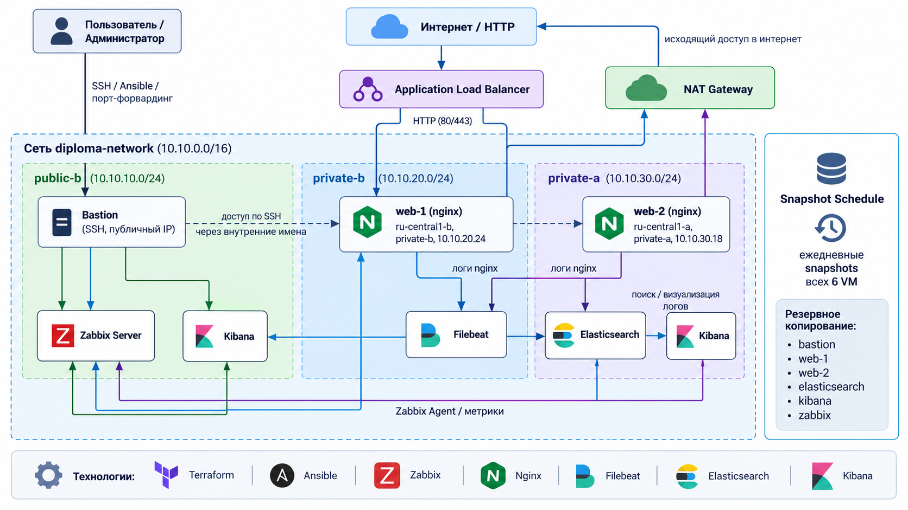

В проекте используется одна VPC и три подсети:

---

## Используемые технологии

* Yandex Cloud
* Terraform
* Ansible
* Nginx
* Zabbix 7.0.30
* PostgreSQL
* Elasticsearch 8.19.21
* Kibana 8.19.21
* Filebeat 8.19.21
* Bash
* Python
* Git
* GitHub

---

## Архитектура

В проекте используется одна VPC и три подсети:

* `public-b` — публичная подсеть;
* `private-b` — приватная подсеть в зоне `ru-central1-b`;
* `private-a` — приватная подсеть в зоне `ru-central1-a`.

Веб-серверы размещены в разных зонах доступности:

* `web-1` — `ru-central1-b`;
* `web-2` — `ru-central1-a`.

У веб-серверов нет публичных IP-адресов. Пользовательский HTTP-трафик поступает к ним только через Application Load Balancer. Для административного доступа к внутренним серверам используется Bastion host.

Elasticsearch также находится во внутренней сети и не имеет публичного адреса. Доступ к его API разрешён только тем сервисам, которым он действительно нужен: Filebeat и Kibana. Для выхода приватных машин в интернет используется NAT Gateway.

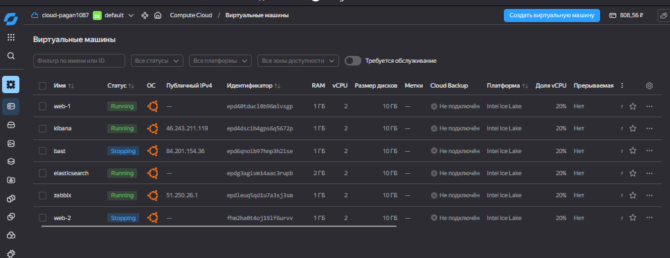

---

## Виртуальные машины

| Сервер | Назначение | RAM |
| --- | --- | ---: |
| bast | Bastion host | 1 GB |
| web-1 | Nginx web server | 1 GB |
| web-2 | Nginx web server | 1 GB |
| zabbix | Zabbix Server | 1 GB |
| elasticsearch | Elasticsearch | 2 GB |
| kibana | Kibana | 1 GB |

В процессе работы конфигурации были дополнительно уменьшены для экономии облачных ресурсов. Большинство машин переведены на 1 GB RAM, Elasticsearch — на 2 GB. После этого я ещё раз полностью удалил и развернул инфраструктуру, чтобы убедиться, что сервисы стабильно работают с новыми лимитами памяти.

Перед финальной сдачей все виртуальные машины переведены в непрерываемый режим:

```hcl
preemptible = false
```

---

## Terraform

Terraform отвечает за создание всей облачной части проекта:

* VPC и подсетей;
* NAT Gateway и таблицы маршрутизации;
* Security Groups;
* виртуальных машин;
* Application Load Balancer;
* Target Group;
* Backend Group;
* HTTP Router;
* расписания snapshot.

Версия провайдера Yandex Cloud зафиксирована, чтобы поведение конфигурации не менялось из-за случайного обновления зависимостей.

Для авторизации используется service account. JSON-ключ в репозиторий не добавляется. Terraform получает путь к нему через локальные переменные окружения:

```bash
export YC_SERVICE_ACCOUNT_KEY_FILE=/path/to/key.json
export YC_CLOUD_ID=...
export YC_FOLDER_ID=...
```

Во время работы провайдер иногда выводил предупреждение о недоступности YC tool initialization service. На создание и изменение ресурсов это не влияло, поэтому отдельный обход для этого предупреждения не понадобился.

---

## Сеть и Bastion

Bastion используется как единая точка административного SSH-доступа. Внутренние серверы доступны по SSH только через него.

Изначально для Bastion был выбран заранее зарезервированный публичный IP. Такой вариант казался удобнее, потому что адрес можно было один раз записать в inventory и больше не менять.

Проблема обнаружилась во время полного восстановления. После очередного `terraform destroy` и повторного создания инфраструктуры новый зарезервированный адрес Bastion оказался недоступен по SSH, хотя сама VM, порт 22 и Security Group были настроены правильно.

Сначала я обошёл проблему вручную: удалил у Bastion проблемный one-to-one NAT и назначил динамический публичный адрес. После этого SSH сразу заработал. Однако такой способ не подходил для воспроизводимого проекта, потому что после каждого восстановления мог потребоваться ручной ремонт.

Поэтому в итоговой версии я изменил схему следующим образом:

1. Terraform больше не закрепляет `nat_ip_address`;
2. Bastion получает динамический публичный IP;
3. `generate_inventory.sh` получает актуальный адрес через Terraform output;
4. из шаблона создаётся новый `ansible/inventory/hosts.ini`;
5. перед подключением старая запись этого IP удаляется из `known_hosts`;
6. `deploy.sh` проверяет не только открытый порт, а реальный SSH-вход по ключу;
7. Ansible запускается только после успешного подключения.

Текущий IP Bastion можно получить через UI YandexCloud или следующей командой:

```bash
terraform output -raw admin_bastion_external_ip
```

Это решение закрывает сразу две проблемы: смену публичного адреса после полного пересоздания и возможный конфликт SSH host key, если облако повторно выдаст уже использовавшийся IP.

---

## Security Groups

Доступ между компонентами ограничен с помощью Security Groups.

Основные правила:

* SSH к Bastion разрешён снаружи;
* SSH к внутренним VM разрешён только от Bastion;
* HTTP к web-серверам разрешён только от Application Load Balancer;
* Elasticsearch на порту 9200 доступен от web-серверов и Kibana;
* Zabbix Agent на порту 10050 доступен от Zabbix Server;
* Zabbix Server на порту 10051 принимает подключения агентов;
* Zabbix frontend доступен по HTTP;
* Kibana доступна по порту 5601;
* приватные серверы используют NAT Gateway для исходящего доступа.

В результате web-серверы и Elasticsearch не нуждаются в публичных IP-адресах, но при этом могут устанавливать необходимые пакеты и обновления.

---

## Ansible

После создания инфраструктуры дальнейшая настройка выполняется Ansible.

Для внутренних серверов inventory использует не IP-адреса, а внутренние FQDN Yandex Cloud:

```ini
web-1-test.ru-central1.internal
web-2-test.ru-central1.internal
zabbix-host.ru-central1.internal
elasticsearch-host.ru-central1.internal
kibana-host.ru-central1.internal
```

Подключение к приватным машинам выполняется через Bastion с помощью SSH `ProxyCommand`.

В моей конфигурации Bastion — единственный узел, для которого в inventory подставляется динамический публичный IP. Остальные серверы доступны по стабильным внутренним DNS-именам.

В каталоге `ansible/roles/` находятся отдельные роли для настройки сервисов:

* `web` — Nginx и содержимое веб-серверов;
* `zabbix_agent` — установка и настройка Zabbix Agent;
* `zabbix_server` — Zabbix Server, PostgreSQL, frontend, PHP-FPM и Nginx;
* `zabbix_bootstrap` — начальная настройка Zabbix через API;
* `elastic_common` — общие зависимости и репозиторий Elastic;
* `elasticsearch` — установка и настройка Elasticsearch;
* `kibana` — установка и настройка Kibana;
* `filebeat` — установка Filebeat и отправка логов Nginx в Elasticsearch.

Playbook-файлы находятся в `ansible/playbooks/`. Главный сценарий — `ansible/playbooks/site.yml`. Он последовательно настраивает агенты, веб-серверы, Zabbix, Elasticsearch, Kibana и Filebeat, а в конце запускает bootstrap Zabbix.

---

## Веб-серверы и Application Load Balancer

На `web-1` и `web-2` устанавливается Nginx. Оба сервера имеют одинаковую конфигурацию.

Application Load Balancer распределяет HTTP-трафик между ними методом `ROUND_ROBIN`.

Для backend настроен HTTP health check:

```text
Path: /
Port: 80
Interval: 5s
Timeout: 2s
```

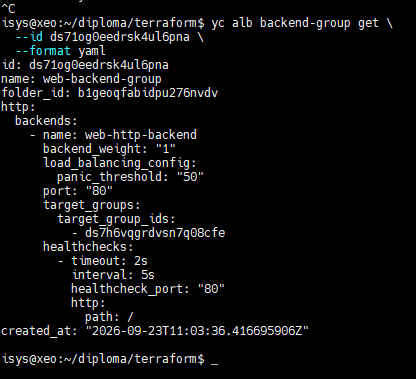

Во время проверки сетевой сегментации прямой HTTP-доступ к web-серверам через Bastion не проходил. Это оказалось не ошибкой, а ожидаемым результатом: Security Group разрешает порт 80 только от Security Group балансировщика. Таким образом сайт доступен через ALB, но сами web-VM напрямую пользователю не открыты.

---

## Elasticsearch

Elasticsearch установлен на отдельной приватной VM. Используется версия `8.19.21`.

Для установки используется зеркало Yandex и локально сохранённый GPG-ключ.

Проблема с установкой проявилась именно после полного восстановления инфраструктуры. На уже настроенной системе всё работало, но первый чистый запуск после `terraform destroy` упал на установке Elasticsearch: репозиторий был уже добавлен, однако Ansible использовал старый apt cache и пакет ещё не был доступен.

Первоначально проблему можно было обойти повторным запуском playbook. Для дипломного проекта такой вариант не подходил, потому что чистое развёртывание должно завершаться с первого раза.

В итоговом варианте задача добавления репозитория сохраняет результат через `register`, а apt cache обновляется сразу после изменения файла репозитория. Если файл не менялся, обновление пропускается. Благодаря этому свежая VM устанавливает Elasticsearch с первого запуска, а повторный прогон не выполняет лишнюю операцию.

Для дипломного стенда X-Pack Security отключён. При этом Elasticsearch не доступен из интернета и защищён Security Groups.

Проверка локального API:

```bash
curl http://127.0.0.1:9200
```

---

## Filebeat и сбор логов

Filebeat установлен на `web-1` и `web-2`. Он собирает журналы Nginx и отправляет их в Elasticsearch по внутреннему DNS:

```text
elasticsearch-host.ru-central1.internal:9200
```

Проверить соединение можно командой:

```bash
filebeat test output
```

После запуска Filebeat в Elasticsearch появляется соответствующий индекс или data stream, а в Kibana можно одновременно увидеть события от обоих веб-серверов.

---

## Kibana

Kibana установлена на отдельной VM и подключается к Elasticsearch по внутренней сети.

Для просмотра логов используется data view `filebeat-*`. В Discover можно отфильтровать события по имени хоста и увидеть записи как от `web-1`, так и от `web-2`.

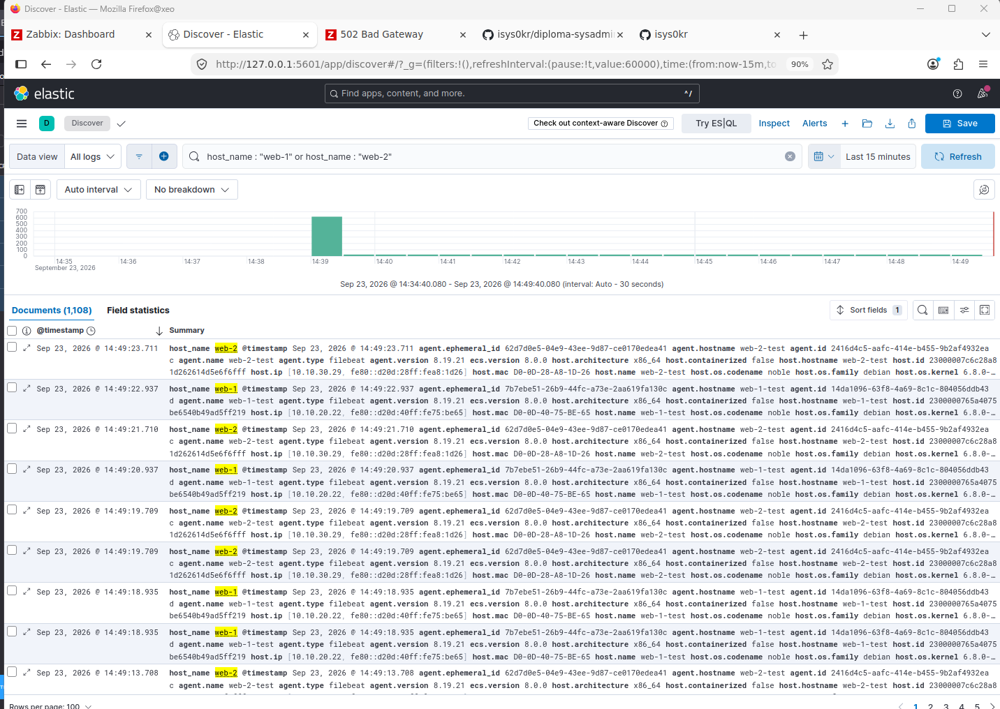

---

## Zabbix

Для мониторинга используется Zabbix 7.0.30.

Zabbix Agent установлен на всех шести виртуальных машинах:

* Bastion;
* web-1;
* web-2;
* Zabbix Server;
* Elasticsearch;
* Kibana.

Главная сложность была не в самой установке агента, а в том, чтобы полностью убрать ручные действия после создания чистой базы Zabbix.

---

## Проблемы с Zabbix frontend

После первого чистого развёртывания процесс Zabbix Server работал, но в браузере открывалась стандартная страница Nginx.

Причина оказалась в пакетной конфигурации `/etc/zabbix/nginx.conf`: директивы `listen` и `server_name` оставались закомментированными, поэтому frontend Zabbix не становился активным сайтом.

Сначала я исправил это вручную: отключил стандартный сайт Nginx и создал отдельный server block для Zabbix.

После этого появилась новая ошибка — `502 Bad Gateway`. Nginx уже направлял PHP-запросы правильно, но файла `/run/php/zabbix.sock` не было. PHP-FPM запускался раньше установки пакета `zabbix-nginx-conf` и поэтому не подхватывал новый pool Zabbix.

Первым рабочим обходом был ручной перезапуск PHP-FPM после установки пакетов. Позже я перенёс эту логику в Ansible.

В итоговой роли `zabbix_server`:

* разворачивается отдельный шаблон Nginx для Zabbix;
* отключается стандартный сайт Nginx;
* создаётся `zabbix.conf.php`, поэтому web installer не нужен;
* проверяется наличие `/run/php/zabbix.sock`;
* PHP-FPM перезапускается только если socket отсутствует;
* Ansible ждёт появления socket;
* перед запуском проверяется конфигурация Nginx;
* bootstrap запускается только после ответа Zabbix API.

Важно, что PHP-FPM не перезапускается безусловно. На свежей VM restart нужен один раз, а при повторном запуске задача пропускается. Это позволило сохранить идемпотентность.

---

## Автоматическая настройка Zabbix

После установки Zabbix Server запускается отдельный bootstrap.

Процесс выглядит так:

1. создаются база PostgreSQL и пользователь Zabbix;
2. при необходимости импортируется схема базы;
3. разворачиваются настройки Zabbix Server и frontend;
4. проверяется PHP-FPM socket;
5. запускается Nginx;
6. Ansible обращается к `apiinfo.version` и ждёт готовности API;
7. Python-скрипт выполняет `user.login`;
8. создаётся правило autoregistration;
9. если правило создано впервые, агенты перезапускаются для ускорения регистрации;
10. bootstrap ждёт появления всех шести хостов;
11. создаётся Web Scenario для ALB;
12. создаются USE Dashboard и HTTP Dashboard;
13. API-сессия завершается.

На этапе разработки для API временно использовался токен, созданный вручную через интерфейс Zabbix. Это помогло разобраться со структурой API, создать dashboard и экспортировать их конфигурацию в JSON.

Однако постоянный токен означал бы, что после чистого развёртывания всё равно требуется ручное действие. Поэтому в финальной версии токен не нужен: bootstrap входит через `user.login`, получает временную API-сессию и завершает её после настройки.

---

## Автоматическая регистрация хостов

На чистой базе агенты уже могли обращаться к Zabbix Server, но сервер отвечал `host not found`, потому что соответствующих объектов ещё не было в базе.

Сначала я создал правило autoregistration вручную через web-интерфейс. После этого все шесть машин успешно появились в Zabbix.
После проверки схемы я перенёс это правило в Python bootstrap.

Когда схема была проверена, то же правило перенесли в Python bootstrap.

Создаётся action `Linux hosts autoregistration`, который выполняет три действия:

* добавляет новый host;
* помещает его в группу `Linux servers`;
* привязывает шаблон `Linux by Zabbix agent`.

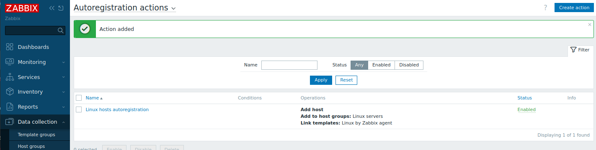

После этого в Zabbix автоматически появляются:

* bast;
* web-1;
* web-2;
* zabbix;
* elasticsearch;
* kibana.

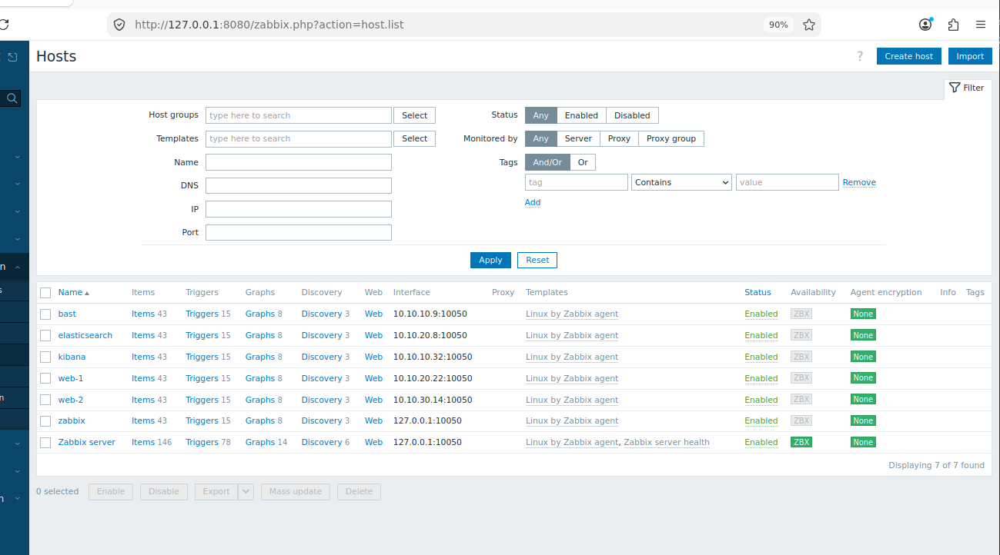

При повторном запуске bootstrap сначала проверяет, существует ли action. Если правило уже есть, агенты не перезапускаются, поэтому повторный прогон не создаёт лишних изменений.

---

## USE Dashboard

Сначала я настроил USE Dashboard вручную через интерфейс Zabbix, чтобы подобрать нужные items и проверить отображение данных.
После этого я создал dashboard через API, экспортировал его в JSON и сохранил в репозитории.


```text
ansible/roles/zabbix_bootstrap/files/dashboards/use-dashboard.json
```

На чистой базе bootstrap восстанавливает его автоматически.

Dashboard показывает:

* загрузку CPU;
* использование памяти;
* использование диска;
* входящий и исходящий сетевой трафик.

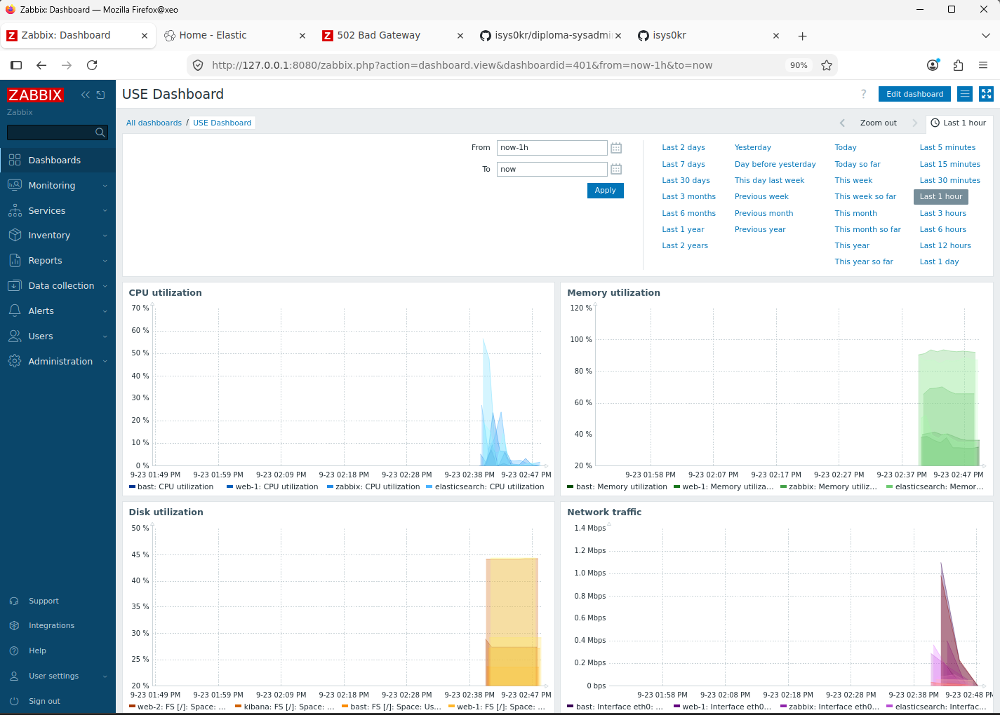

Для диска используется процент занятого пространства файловой системы, для сети — входящий и исходящий трафик.

---

## HTTP monitoring

Для проверки сайта через Application Load Balancer создаётся Web Scenario `Website via ALB`.

URL формируется из текущего `alb_external_ip`, который Terraform передаёт в Ansible во время запуска `deploy.sh`.

Сценарий обращается к главной странице сайта и ожидает HTTP-код 200. Одновременно создаётся отдельный HTTP Dashboard.

Это важно именно для восстановления после `terraform destroy`: публичный адрес ALB может измениться, поэтому его нельзя жёстко сохранить в JSON-конфигурации.

---

## Резервное копирование

Terraform создаёт расписание snapshot `diploma-daily-snapshots`.

Снимки создаются ежедневно и хранятся 7 дней:

```text
retention_period = "168h0m0s"
```

---

## Единый сценарий развёртывания

В итоге весь проект удалось свести к одной команде:

```bash
./scripts/deploy.sh
```

Скрипт последовательно:

1. запускает `terraform apply`;
2. получает актуальные Terraform outputs;
3. генерирует Ansible inventory;
4. получает текущий публичный IP Bastion;
5. удаляет возможную старую запись этого IP из `known_hosts`;
6. ждёт успешного SSH-входа по ключу;
7. получает текущий публичный IP ALB;
8. запускает `ansible-playbook playbooks/site.yml`;
9. передаёт ALB IP в Zabbix bootstrap;
10. ждёт завершения настройки всех сервисов.

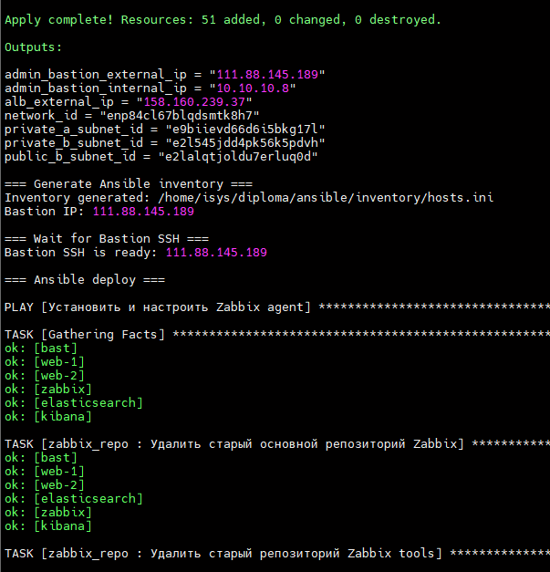

Один и тот же `deploy.sh` используется как для уже существующей инфраструктуры, так и после её полного удаления.

---

## Полное удаление и восстановление

Для проверки воспроизводимости я несколько раз полностью удалял инфраструктуру и разворачивал её заново - фактически выполнял destructive test.

Сначала Terraform формировал план полного удаления:

```text
Plan: 0 to add, 0 to change, 51 to destroy.
```

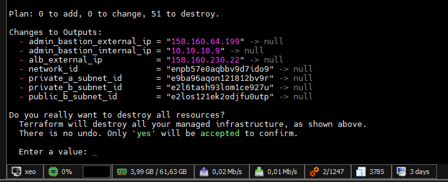

После подтверждения все управляемые ресурсы удалялись:

```text
Destroy complete! Resources: 51 destroyed.
```

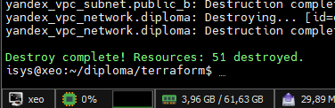

Затем из корня проекта запускалась только одна команда:

```bash
./scripts/deploy.sh
```

Terraform заново создавал VPC, подсети, Security Groups, NAT Gateway, виртуальные машины, Application Load Balancer и snapshot schedule. После появления Bastion скрипт автоматически получал его новый IP, ждал SSH и передавал управление Ansible.

Ansible заново устанавливал и настраивал сервисы. На чистой базе Zabbix создавались autoregistration action, Web Scenario и оба dashboard.

Финальный результат bootstrap выглядел так:

```text
=== WAIT FOR AUTOREGISTERED HOSTS ===
All expected hosts are registered
=== WEB SCENARIO ===
Created scenario: 1
=== DASHBOARDS ===
USE Dashboard: created
HTTP Dashboard: created
BOOTSTRAP OK
```

Таким образом я проверил восстановление не только на уровне кода: инфраструктура действительно полностью удалялась и разворачивалась заново без ручного входа на серверы.

---

## Идемпотентность

После успешного полного восстановления `./scripts/deploy.sh` запускался ещё раз на уже настроенной инфраструктуре.

Ansible завершился без изменений:

```text
bast          changed=0  unreachable=0  failed=0
elasticsearch changed=0  unreachable=0  failed=0
kibana        changed=0  unreachable=0  failed=0
web-1         changed=0  unreachable=0  failed=0
web-2         changed=0  unreachable=0  failed=0
zabbix        changed=0  unreachable=0  failed=0
```

Zabbix bootstrap также только проверил уже существующие объекты:

```text
All expected hosts are registered
Scenario already correct
USE Dashboard: already exists
HTTP Dashboard: already exists
BOOTSTRAP OK
```

Чтобы получить такой результат, по ходу работы пришлось убрать несколько безусловных действий:

* PHP-FPM не перезапускается, если socket уже существует;
* autoregistration action повторно не создаётся;
* агенты не перезапускаются, если action уже был создан;
* dashboard не создаются повторно;
* Web Scenario не пересоздаётся без необходимости;
* apt cache Elastic обновляется только после изменения репозитория;
* Terraform при неизменной инфраструктуре возвращает `No changes`.

Именно повторный запуск с `changed=0`, `failed=0` и `unreachable=0` стал основной проверкой того, что конфигурация действительно идемпотентна.

---

## Проверка отказоустойчивости

Веб-серверы находятся в двух разных зонах доступности.

Application Load Balancer проверяет оба backend по HTTP на порту 80 и распределяет между ними пользовательский трафик.

Поскольку прямой доступ к web-VM закрыт Security Groups, единой точкой входа для сайта является ALB. Если один backend становится недоступен, балансировщик может продолжить направлять запросы на второй.

---

## Репозиторий

Проект разделён на несколько основных каталогов:

* `terraform/` — описание облачной инфраструктуры;
* `ansible/` — playbook, роли, шаблоны и файлы конфигурации;
* `scripts/` — генерация inventory, общий deploy и вспомогательные Zabbix-скрипты;
* `packages/` — локально сохранённые пакеты Zabbix и контрольные суммы;
* `img/` — изображения и скриншоты для README.

Скрипты в `scripts/zabbix/` использовались во время разработки и экспорта конфигурации dashboard. Скрипт, который запускается автоматически во время развёртывания, находится в роли `zabbix_bootstrap`.

---

## Безопасность секретов

В репозитории не хранятся:

* JSON-ключ service account Yandex Cloud;
* API token Zabbix;
* приватный SSH-ключ.

Terraform получает путь к ключу service account из локальной переменной окружения.

В итоговом Zabbix bootstrap постоянный API token не используется. Скрипт ждёт готовности API, выполняет вход, настраивает необходимые объекты и завершает временную API-сессию.

---

## Как менялись решения по ходу работы

Часть архитектурных решений появилась не сразу, а после проверок полного восстановления.

### Bastion: статический IP заменён динамическим

Статический адрес был удобен для простого inventory, но во время destructive test возникла проблема с SSH. После ручной проверки стало понятно, что надёжнее получать новый IP из Terraform и генерировать inventory автоматически.

### Zabbix: ручная настройка заменена API bootstrap

Сначала autoregistration и dashboard создавались вручную, чтобы проверить рабочую конфигурацию. После этого настройки были перенесены в JSON и Python bootstrap.

### API token заменён временной сессией

Постоянный token был удобен во время разработки, но противоречил идее чистого восстановления. Финальная версия сама выполняет login после создания базы Zabbix.

### Безусловные перезапуски заменены проверками состояния

Простой restart PHP-FPM при каждом deploy решил бы проблему с socket, но постоянно давал бы `changed=1`. Поэтому сначала проверяется наличие socket, и только при его отсутствии выполняется restart.

По той же причине Zabbix Agents перезапускаются только при первом создании autoregistration action.

### Обновление apt cache привязано к изменению репозитория

Повторный `apt update` при каждом запуске был бы рабочим, но лишним. Теперь cache обновляется только тогда, когда файл репозитория Elastic действительно изменился.

Эти изменения появились после повторных циклов `destroy → deploy`, поэтому итоговая схема проверена как на уже настроенной системе, так и на полностью чистой инфраструктуре.

---

## Итог

В результате получена воспроизводимая инфраструктура в Yandex Cloud.

Terraform создаёт облачные ресурсы, сеть, балансировщик и резервное копирование. Ansible настраивает операционные системы и сервисы.

Application Load Balancer распределяет запросы между двумя Nginx-серверами в разных зонах доступности.

Zabbix автоматически регистрирует все серверы, создаёт USE Dashboard и контролирует доступность сайта через ALB.

Filebeat отправляет журналы двух веб-серверов в Elasticsearch, а Kibana используется для их просмотра.

Snapshot Schedule ежедневно создаёт резервные копии и хранит их в течение 7 дней.

Полное развёртывание выполняется одной командой:

```bash
./scripts/deploy.sh
```

После полного `terraform destroy` эта команда восстанавливает инфраструктуру и конфигурацию сервисов без ручной настройки.

Повторный запуск завершается с `changed=0`, `failed=0` и `unreachable=0` для всех хостов, что подтверждает итоговую идемпотентность проекта.
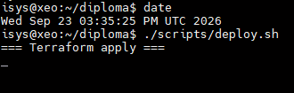

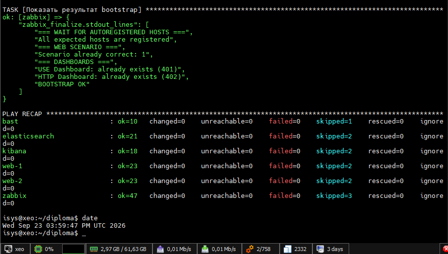


* Все скриншоты из браузера производились при помощи локального хоста + X11 и проброса портов через Bastion, например:
```
 ssh -fN \
-i ~/.ssh/diploma_ed25519 \
-L 8080:zabbix-host.ru-central1.internal:80 \
-L 5601:kibana-host.ru-central1.internal:5601 \
isys@84.201.154.36

```